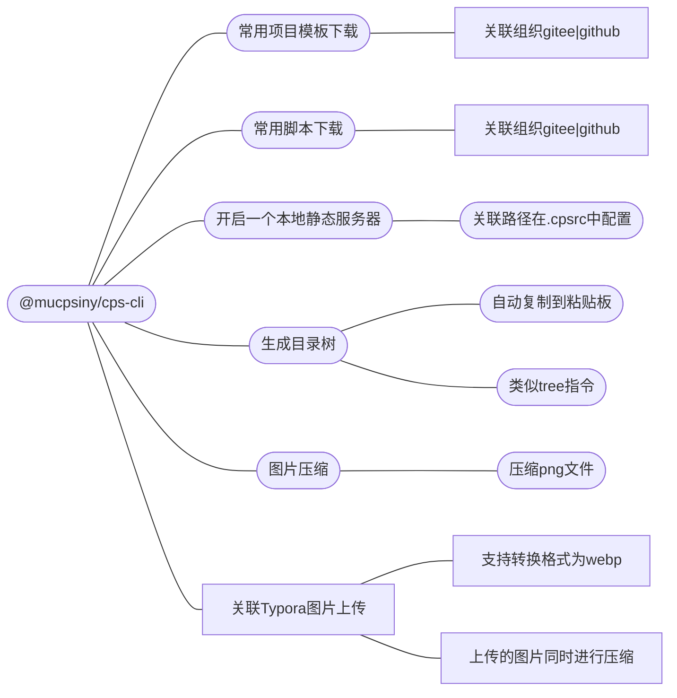
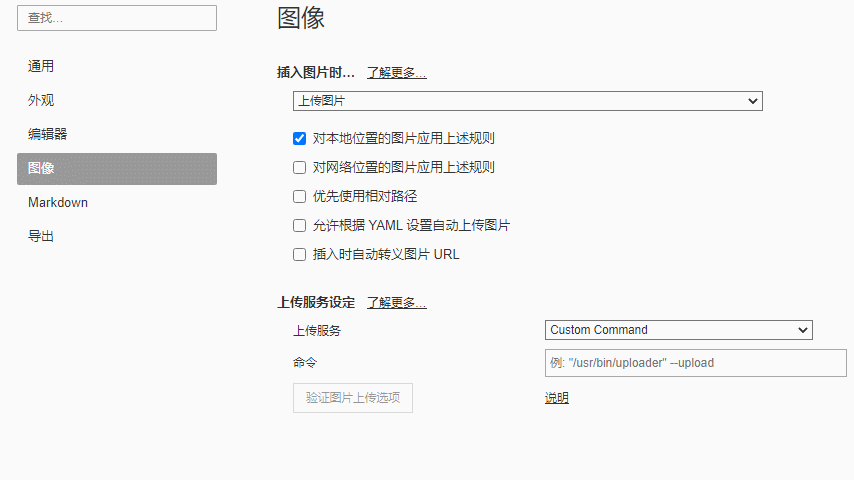
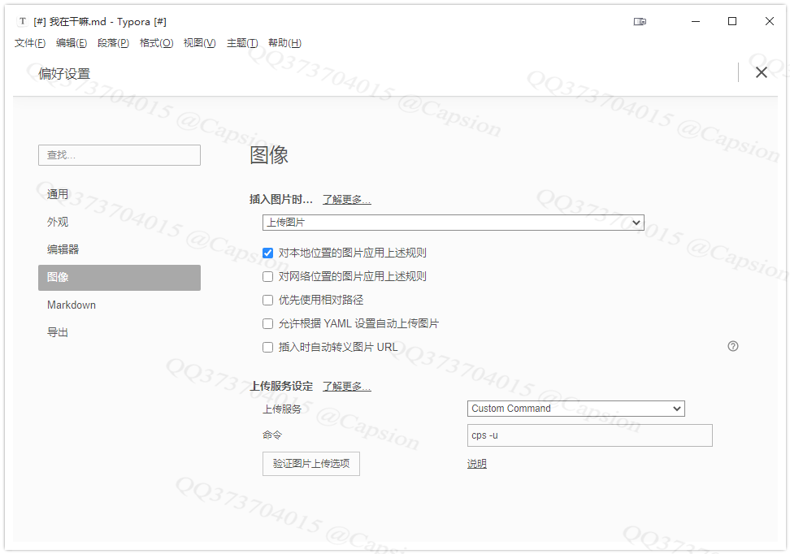

## 简介|Introductions

因为组内的项目都是我搭建的，特意写一个脚手架，可以快速生成一些项目结构，快速添加一些常用脚本到项目中。

<div>
    
    
    
    
    
</div>


## 核心功能|Feature




- 一键下载仓库组织里面的项目
  - [x] 当前默认的仓库组织：https://gitee.com/cps-cli-template
  - [x] 通过配置文件修改关联自己的仓库组织
  - [ ] 添加强制拉取线上数据功能（默认每天首次获取线上，后续采用本地缓存）
- 下载常用的脚本到当前目录
  - [ ] 关联指定仓库，下载自己的工具函数文件
- 支持定义自己的组织仓库
  - [x] gitee
  - [ ] github
  - [ ] gitlab
  - [ ] bitbucket

- 支持Typora上传图片
  - [ ] picgo引擎上传
  - [x] 关联到本地仓库，且自动push到远程仓库
  - [ ] 一键批量替换`md`文件内图片链接
- 配置文件`~/.cpsrc`


## 安装|Install

```bash
npm i -g @mucpsing/cli
```


## 使用|Usage

```bash
$ cps -h
Usage: index [options]

Options:
  -v --version                       # 显示当前版本号
  -t, --template [tempaletName]      # 下载常用模板 .cpsrc.template
  -a, --add <script>                 # 添加常用工具函数 .cpsrc.add
  -c, --compress <imgFile> <output>  # 图片压缩(目前仅支持.png)
  -u, --upload <imgPath>             # 上传图片到gitee/github仓库, 对应配置 .cpsrc.upload
  -s, --server [port]                # 对应配置 .cpsrc.upload.server
  -tr, --tree                        # 生成当前目录的文件数
  --test [any]                       # 测试命令
  -h, --help                         # display help for command
```

 

## 主要功能|Feature

### 1、下载项目模板

通过配置文件绑定一个组织，自由下载该组织下的项目，类似与github的use template功能，以脚手架的方式呈现。通过绑定自己的项目模板组织，在创建项目时可以快速生成对应的模板，提高开发效率。

**语法：**`cps --template <仓库名称[可选]> <本地保存路径[可选]>`

```bash
# 直接在脚手架中选择
$ cps

# 通过flag
cps --template {要下载的模板名称} {本地保存名称}

#or
cps -t {要下载的模板名称} {本地保存名称}

# example：下面的nodt-ts 必须存是真实存在与指定的项目组织中
cps --template node-ts myProjectName
```


### 2、Typora 图片上传关联|Upload

配置文件： `配置.cpsrc` 的 `upload.lcoal.path`字段，绑定本地图片仓库路径

```js
// ~/.cpsrc
{
  "template": {
    "org_name": "cps-cli-template",                           // 组织名称
    "org_url": "https://gitee.com/cps-cli-template",          // 组织真实地址
    "org_path": "C:\\Users\\M2-WIN10\\.cpsrc.org_info",       // 临时保存组织的信息，每日更新，或者手动触发更新
    }
}
```

**Typora配置：**Typora >偏好配置> 图像

- 插入图片时： 选择"上传图片"
- 上传服务：  选择 "自定义命令" (Custom Command)
- 命令： `cps -u` 或者 `cps --upload`







## 配置文件|Configure

### `~/.cpsrc`

默认核心配置文件，插件自动创建。

```js
{
  "template": {
    "org_name": "cps-cli-template",
    "org_url": "https://gitee.com/cps-cli-template",
    "org_path": "C:\\Users\\M2-WIN10\\.cpsrc.org_info",
    "org_add_time": "2022-04-05",
    "org_modify_time": "2022-05-02"
  },
  "upload": {
    "auto_push":true,
    "path": "D:/CPS/MyProject/markdown-image/image/",
    "server":{
      "enable":true, // 开启本地服务期，返回 http://127.0.0.1/xxxx/*.png 图片格式
      "port":"45462"
    }
  }
}
```

### `~/.cpsrc.org_info`

仓库组织的离线数据缓存，因为**gitee**获取组织仓库的**Api**有每日请求次数限制，所以每天只拉取一次线上数据，然后缓存到本地，以`json`格式存储。

  ```js
  // 接口： https://gitee.com/api/v5/orgs/${org_name}/repos 返回的json数据结果：
  {
    ...each_repo_name:{ ../ }
  }
  ```

  

## 项目架构|tree

```ini
DIR:cps-cli                                                      # 
   |-- .github/                                                  # 
   |   |-- workflows/                                            # 「workflows」
   |   |   `-- publish.yaml                                      #  每次更新tag的时候触发，在npm发布新版本
   |-- bin/                                                      # 「bin」 入口文件
   |   `-- index.mjs                                             # 
   |-- dist/                                                     # 「dist」typescript 编译后的文件，目前仅导出mjs
   |-- screenshot/                                               # 「screenshot」
   |   |-- cps-cli/                                              #  项目演示图片
   |-- src/                                                      # 「src」
   |   |-- commands/                                             # 「commands」    存放独立的指令
   |   |   |-- wellcome.mts                                      #  输入cps命令后的首屏展示页
   |   |   |-- test.mts                                          #  --test         测试
   |   |   |-- version.mts                                       #  -v --version   版本信息
   |   |   |-- upload.mts                                        #  -u --upload    Typora上传
   |   |   |-- tree.mts                                          #  -tr --tree     目录树
   |   |   |-- template.mts                                      #  -t  --template 项目模板下载
   |   |   |-- server.mts                                        #  -s  --server   本地静态服务器
   |   |   `-- config.mts                                        #  .cpsrc         项目配置文件管理
   |   |-- scripts/                                              # 「scripts」  一些自用脚本汇总
   |   |   |-- python/                                           # 「python」   py脚本错放，后面增加js，node，lua等
   |   |-- utils/                                                # 「utils」    工具函数目录
   |   |   |-- shell.mts                                         # 
   |   |   |-- server.mts                                        # 
   |   |   |-- pngquant.mts                                      # 
   |   |   |-- index.mts                                         # 
   |   |   |-- gitee-download.mts                                # 
   |   |   `-- git-tools.mjs                                     # 
   |   |-- test.mts                                              # 
   |   |-- index.mts                                             # 
   |   |-- globaltype.d.mts                                      # 
   |   `-- env.mts                                               # 
   |-- tools/                                                    # 「tools」
   |   |-- pngquant/                                             # 「pngquant」   png图片压缩
   |   |-- wepb/                                                 # 「wepb」       webp转换工具
   |-- types/                                                    # 「types」
   |   `-- index.d.mts                                           # 
   |-- __test__/                                                 # 「__test__」
   |-- yarn.lock                                                 # 
   |-- yarn-error.log                                            # 
   |-- tsconfig.json                                             # 
   |-- README.md                                                 # 
   |-- package.json                                              # 
   |-- LICENSE                                                   # 
   |-- index.mjs                                                 # 
   |-- .npmrc                                                    # 
   |-- .npmignore                                                # 
   `-- .gitignore                                                # 
```


## 联系方式|Contact

- **373704015 (qq、wechat、email)**
