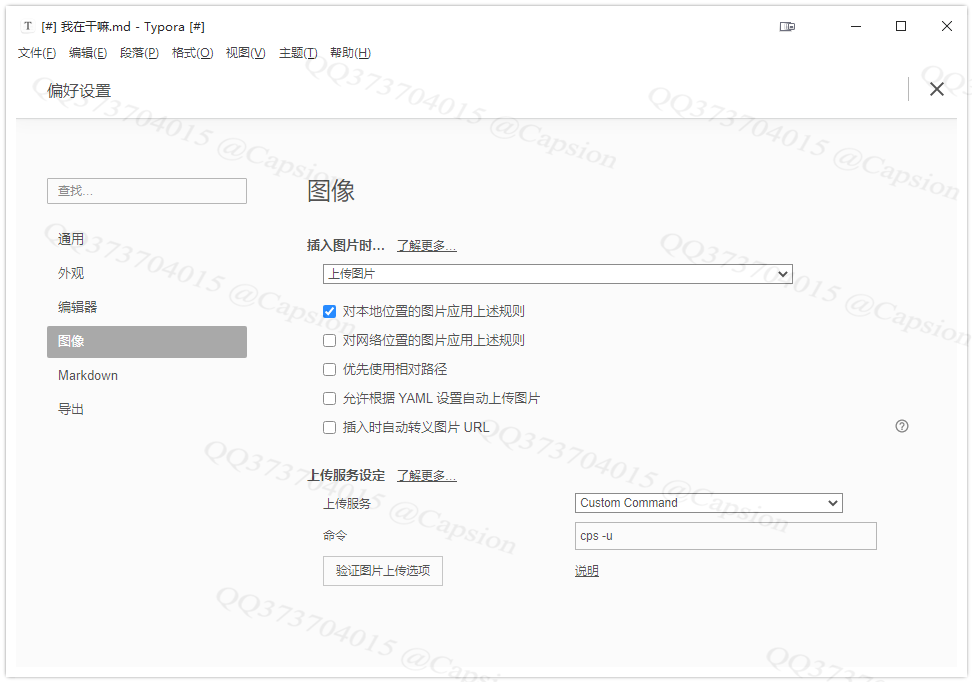

# 简介|Introductions

因为组内的项目都是我搭建的，特意写一个脚手架，可以快速生成一些项目结构，快速添加一些常用脚本到项目中。

<div>
    
    
    
    
    
</div>
[English](./README.en.md) | 简体中文


## 目录|Index

1. [简介|Introductions](#简介|Introductions)
2. [基础功能|Base](##基础功能|Base)
3. [安装|Install](#安装|Install)
4. [使用|Usage](#使用|Usage)
5. [配置|Settings](#配置|Settings)
6. [联系方式|contact](#联系方式|contact)


## 主要功能|Base

- 一键下载仓库组织里面的项目
  - [x] 当前默认的仓库组织：https://gitee.com/cps-cli-template
  - [x] 通过配置文件修改关联自己的仓库组织
  - [ ] 添加强制拉取线上数据功能（默认每天首次获取线上，后续采用本地缓存）
- 下载常用的脚本到当前目录
  - [ ] 关联指定仓库，下载自己的工具函数文件
- 支持定义自己的组织仓库
  - [x] gitee
  - [ ] github
  - [ ] gitlab
  - [ ] bitbucket

- 支持Typora上传图片
  - [ ] picgo引擎上传
  - [x] 关联到本地仓库，且自动push到远程
  - [ ] 一键批量替换`md`文件内图片链接


# 安装|Install

```bash
npm i -g @mucpsing/cli
```


# 使用|Usage

```bash
$ cps -h
Usage: index [options]

Options:
  -t, --template [tempaletName]  下载常用模板 .cpsrc.template
  -a, --add <script>             添加常用工具函数 .cpsrc.add
  -u, --upload <imgPath>         上传图片到gitee/github仓库, 对应配置 .cpsrc.upload
  -s, --server [port]            对应配置 .cpsrc.upload.server.port
  --test [any]                   测试命令

  -h, --help                     display help for command
```


## 1. 组织仓库快速下载|Template

### **only Command**

```bash
$ cps
```


### **with Flag:**

```bash
$ cps <flag>

cps --template
#or
cps -t
```


### **with Flag And Options:**

```bash
$ cps <flag> [<option1>, [<option2>]]

cps --template <仓库名称[可选]> <本地保存路径[可选]>
# or
cps -t
# or
cps --template node-ts myProjectName
```


## 2. Typora 图片上传关联|Upload

首先

- 配置 `.cpsrc` 的 `upload.lcoal.path`字段，绑定本地图片仓库路径

  ```js
  // ~/.cpsrc
  {
    "upload": {
      "auto_push":true, // 上传的图片的同时push到远程

      // 关联本地图片仓库目录，图片实际复制目录
      // 比如我的图片仓库地址是： https://gitee.com/capsion/markdown-image
      // 实际图片都是存放在 仓库的image目录下，所以本地的仓库也存在image
      "path": "D:/CPS/MyProject/markdown-image/image/",

      // 本地服务器配置
      // 根据path的dirname会自动生成态路由： http://localhonst:port/{image}/*.png|jpg
      "server": {
        "enable":true,
        "port": "45462"
      }
  }
  ```


- Typora > 偏好配置 > 图像
  - 插入图片时： 选择"上传图片"
  - 上传服务：  选择 "自定义命令" (Custom Command)
  - 命令： `cps -u` 或者 `cps --upload`
  


# 配置|Settings

- `~/.cpsrc`

  默认核心配置文件，插件自动创建

  ```js
  {
    "template": {
      "org_name": "cps-cli-template",
      "org_url": "https://gitee.com/cps-cli-template",
      "org_path": "C:\\Users\\M2-WIN10\\.cpsrc.org_info",
      "org_add_time": "2022-04-05",
      "org_modify_time": "2022-05-02"
    },
    "upload": {
      "auto_push":true,
      "path": "D:/CPS/MyProject/markdown-image/image/",
      "server":{
        "enable":true, // 开启本地服务期，返回 http://127.0.0.1/xxxx/*.png 图片格式
        "port":"45462"
      }
    }
  }
  ```


- `~/.cpsrc.org_info`

  仓库组织的离线数据缓存，因为**gitee**获取组织仓库的**Api**有每日请求次数限制，所以每天只拉取一次线上数据，然后缓存到本地，以`json`格式存储。


  ```js
  // 接口： https://gitee.com/api/v5/orgs/${org_name}/repos 返回的json数据结果：
  {
    ...each_repo_name:{ ../ }
  }
  ```
  
  

# 联系方式|Contact

- **373704015 (qq、wechat、email)**
