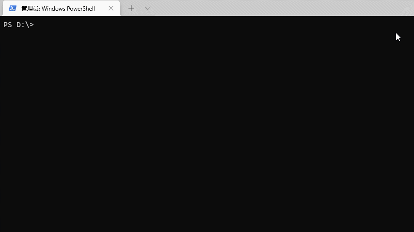
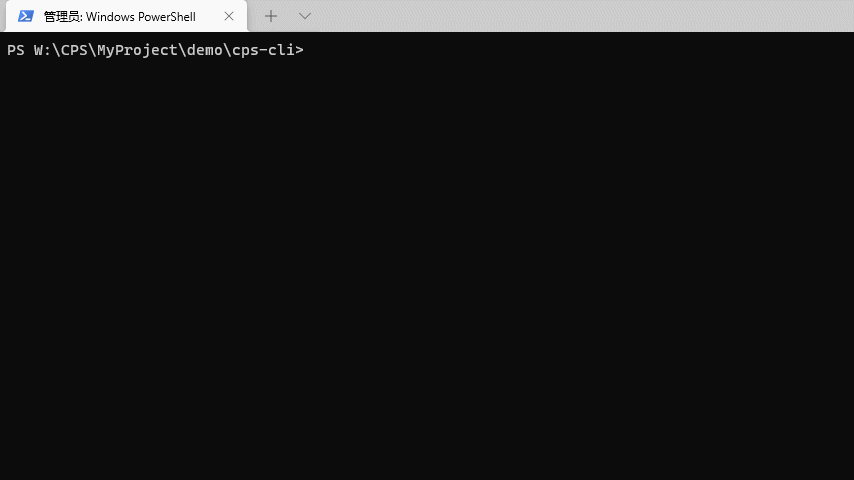

# 项目简介

因为组内的项目都是我搭建的，特意写一个脚手架，可以快速生成一些项目结构，快速添加一些常用脚本到项目中。

<div>
    
    
</div>
**[English](README.en.md) | 简体中文**

# 安装 | Install

```bash
npm i -g cps-cli

yarn add cps-cli -g
```


# 使用 | Usage

```bash
$ cps
```




```bash
$ cps <command>
```




```bash
$ cps <command> [<option>, [<option>]]
```


# 功能实现

- [x] 常用项目搭建
  - [x] electron + vue3 + vite + tailwindCSS
  - [x] node + esm (>=16.x)
  - [x] node + ts + rollup (CommonJS + EMS + UMD)
  - [x] python（纯脚本）
- [x] 快速添加一些常用的脚本到项目
- [ ] 支持定义自己的组织仓库
  - [ ] gitee
  - [ ] github


# 版权 | License
