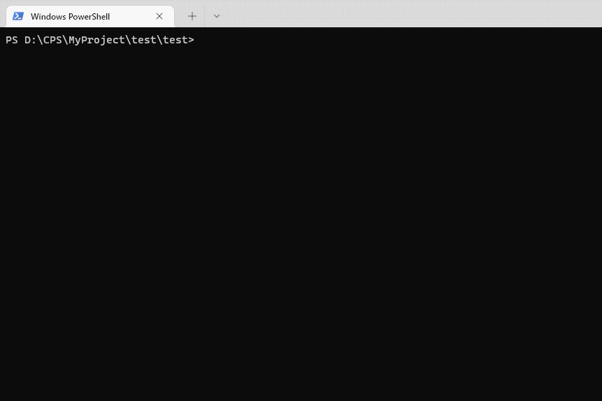

# 简介 | Introductions

因为组内的项目都是我搭建的，特意写一个脚手架，可以快速生成一些项目结构，快速添加一些常用脚本到项目中。

<div>
    
    
  	
  	
  	
</div>
[English](./README.en.md) | 简体中文


# 目录 | Index

1. [简介|Introductions](# 简介 | Introductions)
2. [基础功能|Base](# 基础功能 | Base)
3. [安装|Install](# 安装 | Install)
4. [使用|Usage](# 使用 | Usage)
5. [配置|Settings](# 配置 | Settings)
6. [联系方式|contact](# 联系方式 | contact)


# 基础功能 | Base

- 下载仓库组织里面的项目
  - [x] electron + vue3 + vite + tailwindCSS
  - [x] node + esm (>=16.x)
  - [x] node-ts：rollup (CommonJS + EMS + UMD)
  - [x] python-project-base（纯脚本）
  - [ ] koa-ts
  - [ ] fastify-ts
  - [ ] server-py

- 下载常用的脚本到当前目录

- 支持定义自己的组织仓库
  - [x] gitee
  - [ ] github
  - [ ] gitlab
  - [ ] bitbucket

> 当前 默认组织：https://gitee.com/cps-cli-template 通过配 `~/.cpsrc`置文件修改` 

- 支持Typora上传图片
  - [x] picgo引擎上传
  - [ ] 搭建本地图片服务器
  - [ ] 一键批量替换`md`文件内图片链接


# 安装 | Install

```bash
npm i -g @mucpsing/cps-cli
```


# 使用 | Usage

**基础语法：**

```bash
$ cps -h
Usage: index [options]

Options:
  -t, --template [tempaletName]  下载常用模板 .cpsrc.template
  -a, --add <script>             添加常用工具函数 .cpsrc.add
  -u, --upload <imgPath>         上传图片到gitee/github仓库, 对应配置 .cpsrc.upload
  -h, --help                     display help for command
```


## Command

```bash
$ cps
```




## Command  with Flag

```bash
$ cps <flag>
```


## Command with Flag with Options

```bash
$ cps <flag> [<option1>, [<option2>]]
```


# 配置 | Settings

- `~/.cpsrc`

  默认核心配置文件，插件自动创建

  ```js
  {
    "template": {
      "org_name": "cps-cli-template",
      "org_url": "https://gitee.com/cps-cli-template",
      "org_path": "C:\\Users\\M2-WIN10\\.cpsrc.org_info",
      "org_add_time": "2022-04-05",
      "org_modify_time": "2022-05-02"
    },
    "upload": {
      "picgo": {
        "picBed": {
          "uploader": "gitee-local",
          "current": "gitee-local",
          "gitee-local": {
            "owner": "capsion",
            "repo": "markdown-image",
            "path": "image",
            "token": "{your gitee token}",
            "message": "test"
          }
        }
      }
    }
  }
  ```

  

- `~/.cpsrc.org_info`

  ```js
  // https://gitee.com/api/v5/orgs/${org_name}/repos
  {...org_info}
  ```

  

# 联系方式 | contact

- **373704015 (qq、wechat、email)**
